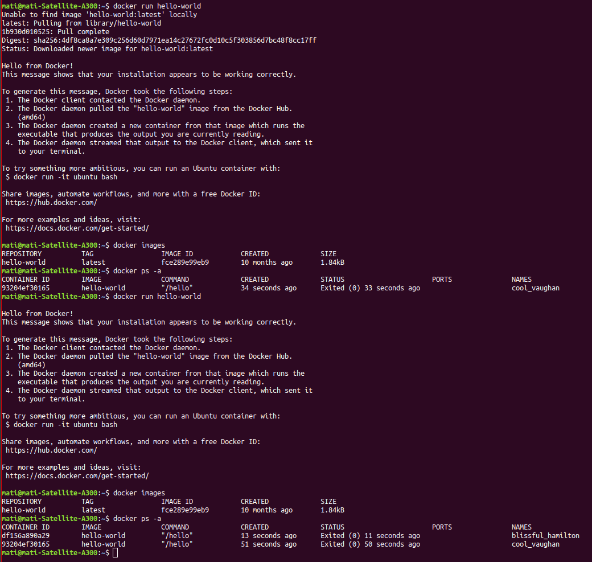
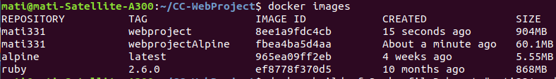
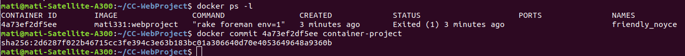
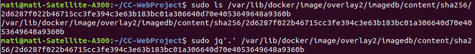
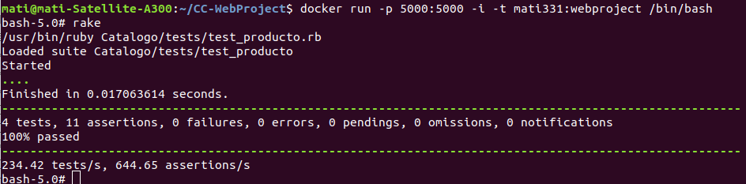

# [Desarrollo basado en pruebas](http://jj.github.io/CC/documentos/temas/Contenedores.html)

### 1º Ejercicio:

***Buscar alguna demo interesante de Docker y ejecutarla localmente, o en su defecto, ejecutar la imagen anterior y ver cómo funciona y los procesos que se llevan a cabo la primera vez que se ejecuta y las siguientes ocasiones.***

### 2º Ejercicio:

***Comparar el tamaño de las imágenes de diferentes sistemas operativos base, Fedora, CentOS y Alpine, por ejemplo.***

### 3º Ejercicio:

***Crear a partir del contenedor anterior una imagen persistente con commit.***

### 4º Ejercicio:

***Examinar la estructura de capas que se forma al crear imágenes nuevas a partir de contenedores que se hayan estado ejecutando.***

### 5º Ejercicio:

***Crear un volumen y usarlo, por ejemplo, para escribir la salida de un programa determinado.***

### 7º Ejercicio:

***Reproducir los contenedores creados anteriormente usando un Dockerfile.***

Dokerfile creado para el proyecto de la asignatura:

        FROM alpine:latest

        MAINTAINER Matilde Cabrera <mati331@correo.ugr.es>

        RUN apk update && apk upgrade && apk add bash ruby-bundler && apk add ruby-full

        # lanzar errores si Gemfile ha sido modificado desde Gemfile.lock
        RUN bundle config --global frozen 1

        RUN mkdir /CC-WebProject
        WORKDIR /CC-WebProject

        COPY Gemfile Gemfile.lock ./

        RUN bundle install 

        COPY . .

        EXPOSE 5000

        CMD ["bundle", "exec", "rackup", "--host", "0.0.0.0", "-p", "5000"]

